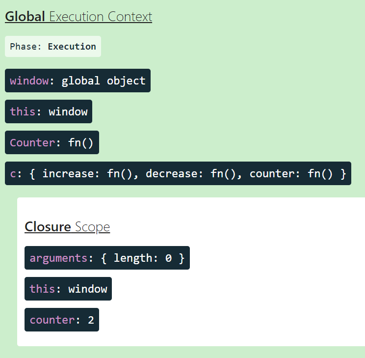

## 1.4 클로저

: **함수와 함수가 선언된 어휘적인 환경 (MDN)**

선언된 어휘적인 환경이라는 것은 변수가 코드 내부에서 어디서 선언됐는지를 말하는 것이다.

😵 **어휘적 환경이란?**

```javascript
function add() {
  const a = 10;
  function innerAdd() {
    const b = 20;
    console.log(a + b);
  }
  innerAdd(); // 30
}
add();
```

a 변수의 유효 범위는 add 전체이고, b의 유효 범위는 innerAdd 전체이다. innerAdd는 add 내부에 선언돼 있어 a를 사용할 수 있게 된 것이다.

**즉, "선언된 어휘적 환경"이라는 것은 변수가 코드 내부에서 어디서 선언됐는지를 말하는 것이다.** 이는코드가 작성된 순간에 정적으로 결정되며 클로저는 이러한 어휘적 환경을 조합해 코딩하는 기법이다.

<br/>

---

### 스코프 (scope)

앞서 클로저를 이해하기 위해서는 변수의 유효 범위에 따라서 어휘적 환경이 결정된다고 언급했다. **이러한 변수의 유효 범위를 스코프라고 한다.**

<br/>

**전역 스코프 (global scope)**

: 전역 레벨에 선언하는 것. 어디서든 호출 가능.

브라우저 환경에서의 전역 객체는 window, Node.js 환경에서는 global이 있는데 바로 이 객체에 선언한 스코프가 바인딩한다.

<br/>

**함수 스코프 (function scope)**

자바스크립트는 기본적으로 함수 레벨 스코프를 따른다. 즉, `{ }`블록이 스코프의 범위를 결정하지 않는다.

<br/>

---

### 클로저의 활용

```javascript
function outerFunction() {
  var x = "hello";
  function innerFunction() {
    console.log(x);
  }

  return innerFunction;
}

const innerFunction = outerFunction();
innerFuction(); // 'hello'
```

위의 예제에서 outerFunction은 innerFuction을 반환하며 실행이 종료됐다. 여기에서 반환한 함수에는 x라는 변수가 존재하지 않지만, 해당 함수가 선언된 어휘적 환경, 즉 outerFunction에는 x라는 변수가 존재하며 접근할 수도 있디.

따라서, 같은 환경에서 선언되고 반환된 innerFunction에서는 x라는 변수가 존재하던 환경을 기억하기 때문에 정상적으로 "hello"를 출력할 수 있다.

<br/>

**클로저의 활용 및 장점**

```javascript
var counter = 0;

function handleClick() {
  counter++;
}
```

위처럼 변수를 전역 레벨에 선언되어 있다면, 누구나 수정할 수 있다. 만약 리액트의 useState의 변수가 전역 레벨에 저장돼 있으면 어떻게 될까? 자바스크립트를 아는 사람이라면 누구나 리액트 어플리케이션을 망가뜨릴 수 있을 것이다.

**따라서 리액트과 관리하는 내부 상태 값은 리액트가 별도로 관리하는 클로저 내부에서만 접근할 수 있다.**

<br/>

```javascript
function Counter() {
  var counter = 0;

  return {
    increase: function () {
      return ++counter;
    },
    decrease: function () {
      return --counter;
    },
    counter: function () {
      console.log("counter에 접근!");
      return counter;
    },
  };
}

var c = Counter();

console.log(c.increase()); //1
console.log(c.increase()); //2
console.log(c.increase()); //3
console.log(c.decrease()); //2
console.log(c.counter()); //2
```

이 코드를 ui.dev에서 실행해보면, 아래 사진과 같이 클로저나 코드가 어떻게 실행되는지 확인할 수 있다.



위와 같이 코드를 변경했을 때 얻을 수 있는 이점에는 여러가지가 있다.

1. counter 변수를 직접적으로 노출시키지 않음으로써 사용자가 직접 수정하는 것을 막았고, 접근하는 경우를 제한해 로그를 남기는 등의 부차적인 작업도 수행할 수 있게 됐다.

2. counter 변수의 업데이트를 increase와 decrease로 제한해 무분별하게 변경되는 것도 막았다.

=> 이처럼, **클로저를 활용하면 전역 스코프의 사용을 막고, 개발자가 원하는 정보만 개발자가 원하는 방향으로 노출시킬 수 있다는 장점이 있다.**

<br/>

**리액트에서의 클로저**

리액트에서 대표적으로 클로저의 원리를 사용하고 있는 것은 `useState`이다.

```JSX
function Component() {
    const [state, setState] = useState();

    function handleClick() {
        // useState의 호출은 위에서 끝났지만,
        // setState는 계속 내부의 최신값(prev)를 알고 있다.
        // 이는 클로저를 활용했기 때문에 가능하다.
        setState((prev)=>prev+1)
    }
}
```

외부 함수(useState)가 반환한 내부 함수(setState)는 외부 함수(useState)의 호출이 끝났음에도 자신이 선언된 외부 함수가 선언된 환경(state가 저장되어 있는 어딘가)을 기억하기 때문에 계속해서 state 값을 사용할 수 있는 것이다.

<br/>

**주의할 점**

클로저를 사용할 때 한 가지 주의할 점은, **클로저를 사용하는 데는 비용이 든다는 것이다. 클로저는 생성될 때마다 그 선언적 환경을 기억해야 하므로 추가 비용이 발생한다.**

클로저의 기본 원리에 따라, 클로저가 선언된 순간 내부 함수는 외부 함수의 선언적인 환경을 기억하고 있어서 이를 어디에서 사용하는지 여부와 관계없이 저장해둔다.

즉 클로저에 꼭 필요한 작업만 남겨두지 않는다면, **메모리를 불필요하게 잡아먹는 결과**를 야기할 수 있고, 마찬가지로 클로저 사용을 적절한 스코프로 가둬두지 않는다면 **성능에 악영향**을 미칠 수 있다.

<br/>
