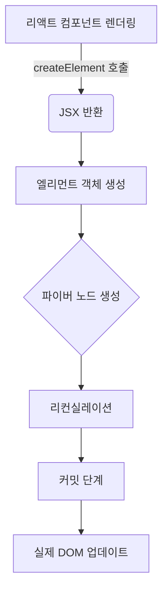

## 2.4 렌더링은 어떻게 일어나는가?

### 2.4.1 리액트의 렌더링이란?

### 2.4.2 리액트의 렌더링이 일어나는 이유

### 2.4.3 리액트의 렌더링 프로세스

**리액트 코드가 파이버 트리로 변환되는 과정**

```mermaid
graph TD;
    A[리액트 컴포넌트 렌더링] -->|createElement 호출| B(JSX 반환)
    B --> C[엘리먼트 객체 생성]
    C --> D{파이버 노드 생성}
    D --> E[리컨실레이션]
    E --> F[커밋 단계]
    F --> G[실제 DOM 업데이트]
```

### 2.4.4 렌더와 커밋

### 2.4.5 일반적인 렌더링 시나리오 살펴보기

### 2.4.6 정리